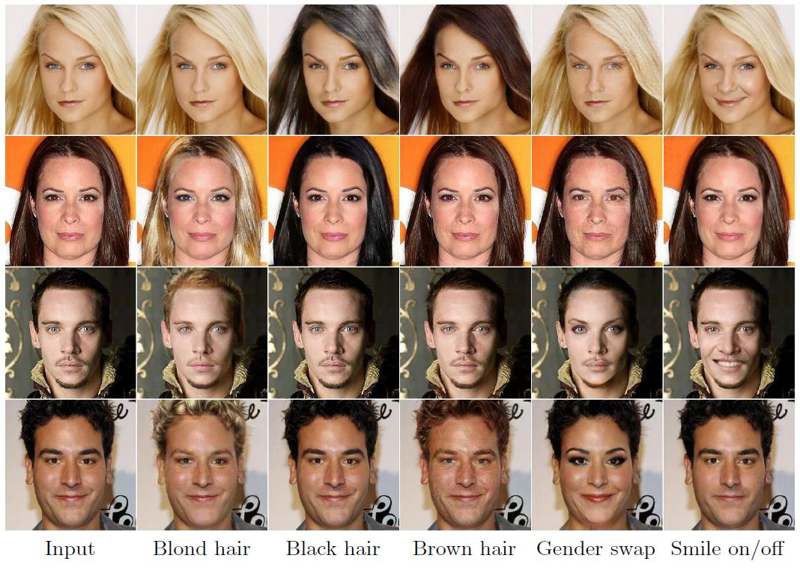

# PerceptualGAN

<p align="center"></p>

This is a PyTorch implementation of the paper <b>[Image Manipulation with Perceptual Discriminators](https://arxiv.org/abs/1809.01396)</b>
<br/>

Diana Sungatullina<sup> 1</sup>, Egor Zakharov<sup> 1</sup>, Dmitry Ulyanov<sup> 1</sup>, Victor Lempitsky<sup> 1,2</sup>
<br/>
<sup>1 </sup>Skolkovo Institute of Science and Technology <sup>2 </sup>Samsung Research <br/>

[European Conference on Computer Vision](https://eccv2018.org/), 2018

<b>[Project page](https://egorzakharov.github.io/perceptual_gan)</b>

## Dependencies
* [Python 3.5+](https://www.continuum.io/downloads)
* [PyTorch 0.4.0](http://pytorch.org/)
* [TensorFlow 1.3+](https://www.tensorflow.org/) (for tensorboard)

## Usage

### 1. Cloning the repository
```bash
$ git clone https://github.com/egorzakharov/PerceptualGAN.git
$ cd PerceptualGAN/
```

### 2. Downloading the paper datasets

Please follow the guidelines from official repositories:

[Celeba-HQ](https://github.com/tkarras/progressive_growing_of_gans)

[monet2photo, apple2orange](https://github.com/junyanz/CycleGAN)

### 3. Setting up tensorboard for pytorch

All training data (with intermediate results) is displayed via tensorboard.

Follow the installation instructions in [repository](https://github.com/lanpa/tensorboardX).

To launch, run the following command in repository folder:

```bash
tensorboard --logdir runs
```

### 4. Training

Example usage:
```
$ ./scripts/celebahq_256p_pretrain.sh
$ ./scripts/celebahq_256p_smile.sh
```

In order to achieve best quality results, you need to first pretrain the network as autoencoder.

For that, please use scripts with pretrain suffix for the appropriate dataset. After the pretraining, you can launch the main training script.

Also you need to set the following options within the scripts:

<b>images_path</b>: for Celeba-HQ this should point at the folder with images, otherwise it can be ignored

<b>train/test_img_A/B_path</b>: should point either at the txt list with image names (in the case of Celeba-HQ) or at image folders (CycleGAN).

<b>pretrained_gen_path</b>: when pretraining is finished, should point at the folder with latest_gen_B.pkl file (by default can be specified to:

```
--pretrained_gen_path runs/<model name>/checkpoints
```

For detailed description of other options refer to:

```
train.py
models/translation_generator.py
models/discriminator.py
```

You can easily train the model on your own dataset by changing the paths to your data and specifying input image size and transformations, see the example scripts for reference.

### 5. Testing

In order to test, you need to run the following command and set input_path to the folder with images (optionally, also set img_list to a list with subset of these image names), specify scaling by setting image_size (required for CelebA-HQ), file with network weights (net_path) and output directory (output_path).

Example usage:

```bash
python test.py --input_path data/celeba_hq --img_list data/lists_hq/smile_test.txt --image_size 256 \
--net_path runs/celebahq_256p_smile/checkpoints/latest_gen_B.pkl --output_path results/smile_test
```

### 6. Pretrained models

Models are accessible via the [link](https://drive.google.com/drive/folders/1-t65qKm36HPElbr7hu98Bt6FZ4lFv4ve?usp=sharing).

If you want to use finetuned VGG for better results, you can download it and put in the repository folder. Also you will have to set enc_type option:

```
--enc_type vgg19_pytorch_modified
```
Default PyTorch VGG network is used in the example scripts.

</br>

## Acknowledgements

This work has been supported by the Ministry of Education and Science of the Russian Federation (grant 14.756.31.0001).
